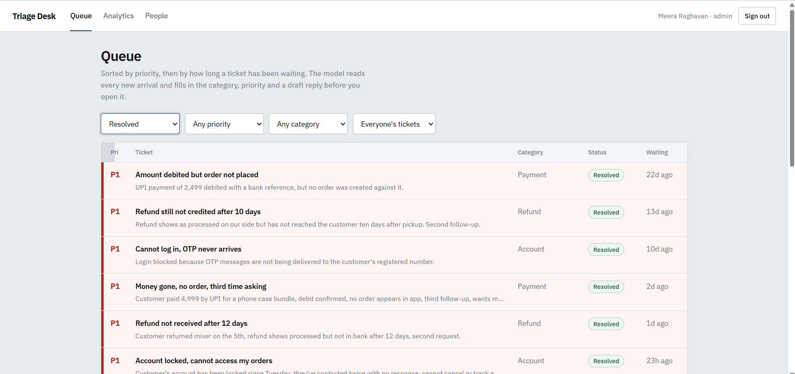

# Triage Desk

Every incoming support ticket is read by a language model before a human sees
it. The model sets a category and a priority, writes a one-line summary, and
drafts a reply the agent edits and sends.

Without it, a customer whose money is stuck sits in the same list as someone
asking where the size chart is, and an agent has to open both to find out which
is which.



## Roles

| Role | Can do |
| --- | --- |
| Customer | Raise tickets, follow their own |
| Agent | Work the priority-sorted queue, edit drafts, leave internal notes, resolve |
| Admin | All of the above, plus analytics and granting or removing agent access |

Admin accounts are seeded into the database. No API route can create one.

## Stack

Node 18+, Express 4, SQLite (better-sqlite3), JWT + bcrypt.
React 18, Vite, React Router, Recharts.
Model: Groq or Anthropic, chosen by which key is set, with an offline fallback.

## Running it

```powershell
# Terminal 1
cd server
npm install
copy .env.example .env
node -e "console.log(require('crypto').randomBytes(32).toString('hex'))"
# paste that as JWT_SECRET in .env
npm run seed
npm run dev
```

```powershell
# Terminal 2
cd client
npm install
npm run dev
```

Open http://localhost:5173. The sign-in page has one-click buttons for the
seeded accounts, so a demo needs no typing.

| Email | Role |
| --- | --- |
| `admin@shopkart.test` | admin |
| `rahul@shopkart.test` | agent |
| `ankit@example.test` | customer |

These are public demo accounts on throwaway data. `npm run seed` resets the desk.

### Model key

`GROQ_API_KEY` and `ANTHROPIC_API_KEY` are both optional. With neither, triage
falls back to keyword rules and every screen still works. `.env` is read at
boot, so restart after editing it — `node --watch` only watches `.js` files.
The boot line says which path is live.

## How a ticket moves

1. `POST /api/tickets` writes the row and returns immediately with
   `triageStatus: "pending"`.
2. A background worker finds resolved tickets with overlapping wording and
   passes them to the model as worked examples.
3. The model returns JSON. It is parsed defensively, every field checked against
   an allow-list, then written to `ai_analysis`.
4. The queue polls every five seconds and the ticket takes its place.

If the model call fails, `triage_status` becomes `failed`. The ticket is never
lost, and an agent can retry it.

## Decisions

**Triage runs after the response, not inside it.** A model call takes 2–3
seconds. Filing a ticket should not wait on it, and a model outage should not
stop tickets being filed.

**AI output has its own table.** Re-running triage replaces one row and never
touches the customer's words. A `model_used` column records which model read it.

**Roles decide scope in SQL, not in the UI.** `GET /api/tickets` is one endpoint
returning three different result sets. Internal notes are dropped from the query
before the response is built — hiding them with CSS would still ship them in the
body. The message route also ignores an `internal: true` flag sent by a
customer.

**Role changes cannot escalate.** The route accepts only `customer` or `agent`,
and refuses to touch an admin row. Two separate guards, because they close two
different holes: nobody can promote themselves, and nobody can demote the last
manager and lock the desk.

**Model output is untrusted input.** `extractJson` pulls the outermost object
out of whatever came back; `coerce` forces every field onto an allowed value. A
malformed response degrades, it does not crash.

**Retrieval is lexical, and says so.** Word overlap, no embeddings, no extra
service. Swapping in pgvector is a change to one function.

**Draft adoption is measured.** Sending a draft untouched sets a flag, and
analytics reports the rate. It is the only honest answer to whether the AI step
saves anyone time.

**Nothing reaches a customer without a human pressing send.** The section below
is why.

## Bugs found while testing

All of these came from trying to break the app, not from using it correctly.

| Bug | Cause |
| --- | --- |
| Malformed JSON returned 500 | Error handler mapped everything to 500. A bad request body is a 400 — the client's mistake, not the server's. |
| Draft box did not refresh after re-triage | The guard protecting an agent's typing could not tell an untouched box from an edited one. |
| Spinner and stale verdict rendered together | Re-triage sets pending while the old analysis row still exists, so both conditions were true. |
| Model invented company policy | Asked twice about payment methods it said "we accept UPI" and "UPI is not supported". Fixed by grounding the prompt to the ticket and retrieved examples. |
| Model invented a currency | `18,400` came back as `$18,400`, once `€18,400`. Far harder to spot than the policy one — a dollar sign in a support reply looks normal. |
| One ticket classified P1 and P4 | See below. |
| Deprecated model id returned 404 | The Groq model had been retired for the free tier. |
| Boot log named a different model than the one being called | The log and the request builder each had their own hardcoded default. |
| A table broke the whole page layout | Six columns were wider than a phone viewport, so the entire page scrolled sideways, not just the table. |
| Two nav links active at once | `/tickets/new` is prefixed by `/tickets`, and `NavLink` prefix-matches by default. |

### The P1/P4 one

Same ticket, same model, two runs, opposite priorities. The customer had written
"I am not in any hurry" while also reporting a repeated failure, and the rules
said nothing about what a customer's own urgency was worth.

`temperature: 0` did not fix it. Temperature does not change a model's
confidence — it picks the top answer, and there was no clear top answer. The
model had two defensible readings and no rule to choose between them.

The fix was a tie-breaker in the prompt: what the customer says about their own
urgency outranks the keywords in their message. Five consecutive runs agreed
afterwards.

Inconsistent model output is usually a gap in the spec, not a weakness in the
model.

## Prompt tuning

Checked against deliberately misleading tickets, five runs each:

| Ticket | Keyword rules | Model |
| --- | --- | --- |
| Polite thanks for a fast refund | P1 Refund | P4 General |
| Payment methods question before buying | P1 Payment | P4 General |
| Reset failing, "I am not in any hurry" | P1 Account | P4 Account |
| Account locked, 18,400 stuck, written politely | — | P1 Account |
| "EXTREMELY URGENT" stock availability question | P4 General | P4 General |

The last two are the pair that matters. A desk that ranks by tone rewards
whoever shouts loudest and buries the polite customer whose money is gone.

## Not built, on purpose

- **Password reset.** Needs email delivery and a verified address first. A reset
  flow without one is an account takeover route, not a feature.
- **Email verification.** The current check is a format test, which accepts
  `user@gamil.com` because that is a well-formed address. Only sending mail to
  it proves anything.

## Would change in production

- Postgres instead of SQLite — required on any host whose disk resets on deploy.
- Redis and BullMQ instead of the in-process queue — two API instances would
  both pick up the same ticket.
- Server-sent events instead of polling.
- Rate limiting on ticket creation, so one account cannot burn the model budget.
- Embeddings for retrieval, once word overlap starts missing paraphrases.

## Layout

```
server/src/
  index.js              Express app and boot
  db/                   schema.sql, migration, seed
  routes/               auth, tickets, analytics, users
  services/             ai.js (prompt, call, validation, fallback)
                        triageQueue.js (worker, retrieval)
  middleware/auth.js    JWT verification and role guards

client/src/
  App.jsx               Routes and role guards
  lib/                  Fetch wrapper, auth context
  pages/                Sign in, queue, ticket detail, analytics, people
```

## Deploying

The API is a plain Node process. Set `JWT_SECRET`, a model key, and
`CORS_ORIGIN`. SQLite needs a persistent disk with `DB_FILE` pointing at it; on
a free tier without one the database resets on restart.

The client builds with `npm run build`. Add a rewrite from `/api` to the API,
and a catch-all to `index.html` so client-side routes survive a refresh.